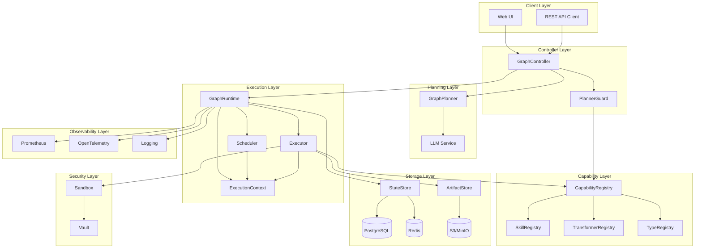
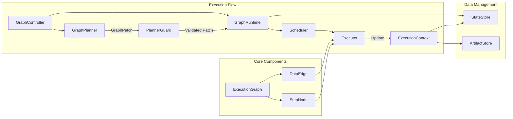
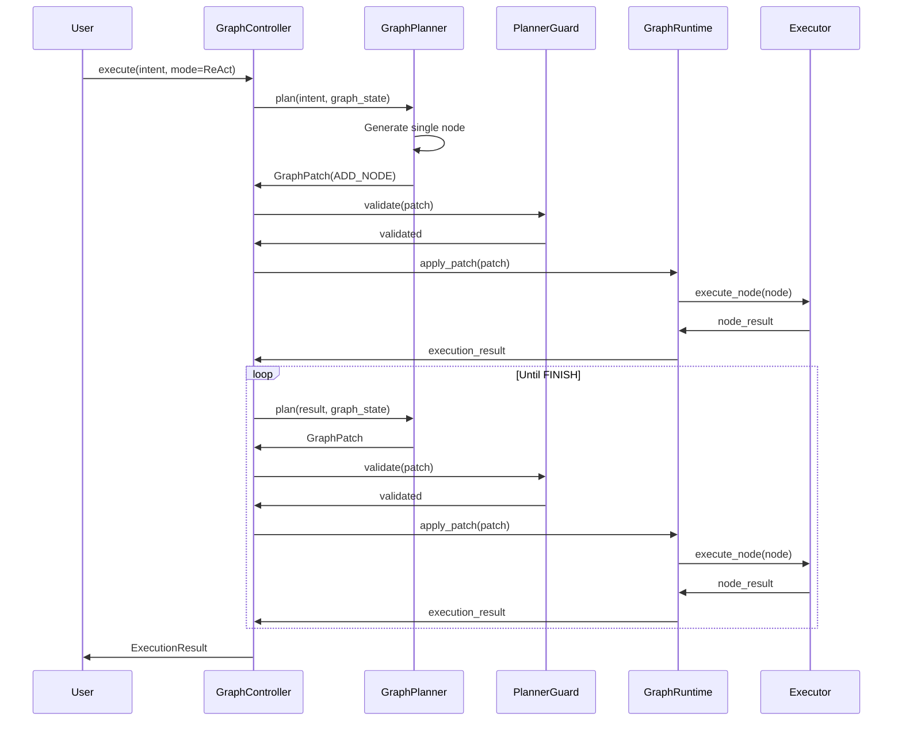
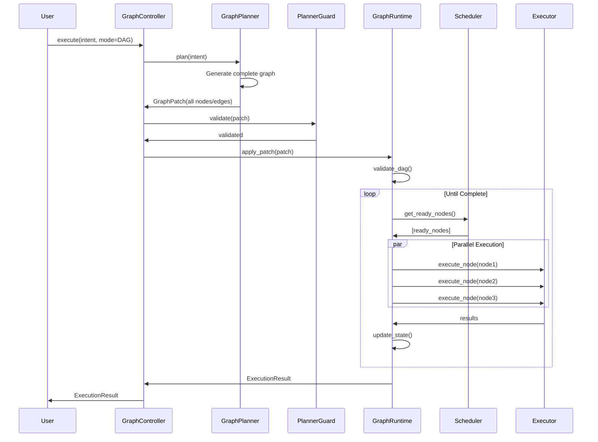
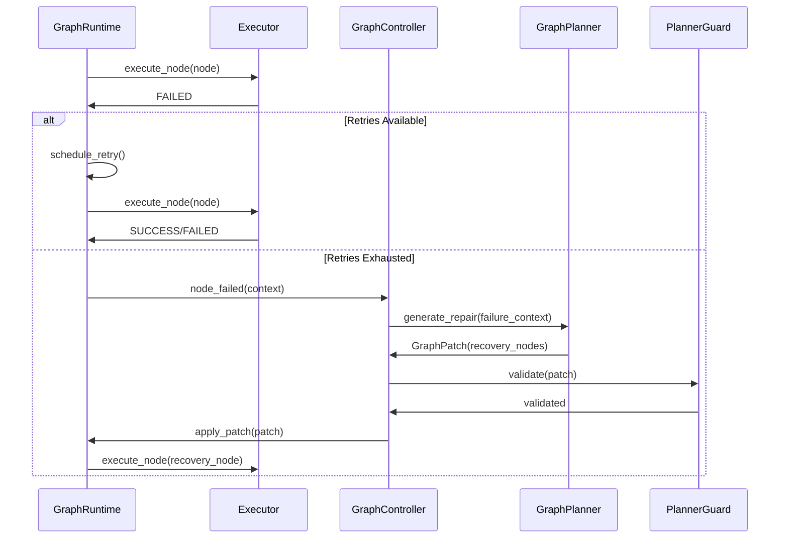
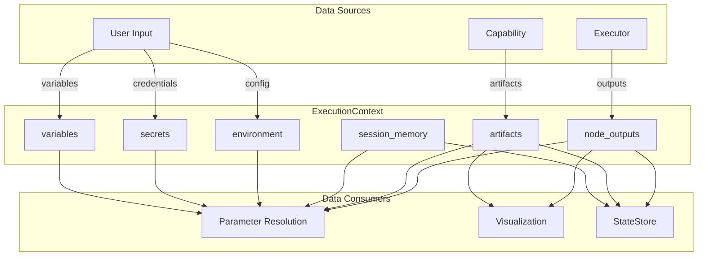
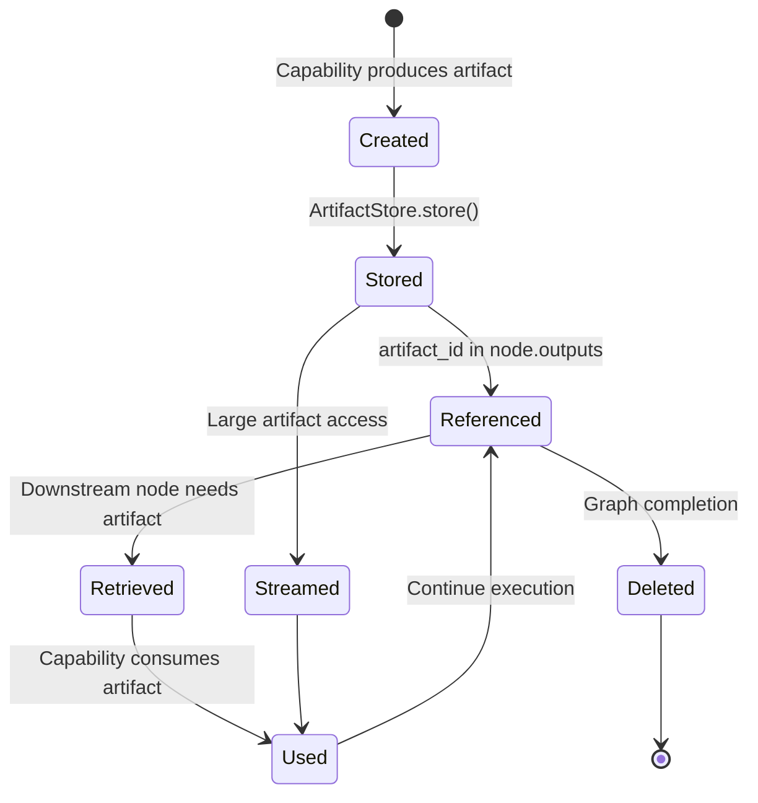

# Design Document: Graph Runtime Architecture

## Overview

The Graph Runtime Architecture is a next-generation AI Agent execution system that transforms the existing linear process model (AgentLoop + DagRunner) into a typed data flow graph execution model. This system provides automatic parallel execution, type-safe parameter passing, unified ReAct and DAG execution models, comprehensive error recovery mechanisms, and real-time visualization capabilities.

The architecture achieves Production Agent Platform level (Level 5) by introducing critical components:
- **ExecutionContext**: Unified runtime context for all execution data
- **ArtifactStore**: Large artifact management for files, images, datasets
- **PlannerGuard**: LLM safety protection against dangerous operations
- **Capability Cost Model**: Cost tracking and budget control
- **Graph Versioning**: Version history for debugging and replay

### Design Goals

1. **Type Safety**: Eliminate string template errors through typed DataEdge connections
2. **Parallelism**: Automatic detection and execution of independent nodes
3. **Determinism**: Reliable execution independent of LLM non-determinism
4. **Observability**: Comprehensive metrics, logging, and tracing
5. **Recoverability**: Automatic retry, LLM-based repair, and state persistence
6. **Scalability**: Support for graphs with 200+ nodes and 1000+ edges
7. **Security**: Sandboxed execution, resource limits, and policy enforcement
8. **Cost Control**: Budget tracking and optimization

### Key Architectural Decisions

**Decision 1: Adjacency Index for O(V) Scheduling**
- **Rationale**: Traditional graph traversal requires O(E) time to find dependencies. With adjacency indexes (incoming_edges, outgoing_edges), we achieve O(V) scheduling time.
- **Trade-off**: Additional memory overhead (~2x edge storage) for significant performance gain in large graphs.

**Decision 2: ExecutionContext as Single Source of Truth**
- **Rationale**: Previous architecture scattered data across node.outputs, session memory, and environment variables, causing inconsistency and debugging difficulty.
- **Trade-off**: Centralized state management simplifies access but requires careful concurrency control.

**Decision 3: Three-Layer Skill Architecture**
- **Rationale**: Exposing 100+ primitive skills to LLM causes confusion and poor planning. Three layers (Primitive Skills → Capabilities → Planner Tools) provide appropriate abstraction.
- **Trade-off**: Additional indirection layer but dramatically improved LLM planning quality.

**Decision 4: PlannerGuard for Safety**
- **Rationale**: LLMs can generate dangerous operations (delete system files, infinite loops). Pre-validation prevents execution of unsafe patches.
- **Trade-off**: Additional validation overhead but essential for production safety.

**Decision 5: Graph Versioning for Debugging**
- **Rationale**: Complex graph evolution makes debugging difficult without history. Versioning enables replay and diff analysis.
- **Trade-off**: Storage overhead but critical for production debugging.

## Architecture

### System Architecture



### Component Relationships



### ReAct Mode Execution Flow



### DAG Mode Execution Flow



### Error Recovery Flow



### ExecutionContext Data Flow



### Artifact Lifecycle



## Components and Interfaces

### Core Data Models

#### ExecutionGraph

```python
from typing import Dict, List, Optional
from enum import Enum
from pydantic import BaseModel, Field
from datetime import datetime

class GraphStatus(str, Enum):
    PENDING = "pending"
    RUNNING = "running"
    SUCCESS = "success"
    FAILED = "failed"
    PAUSED = "paused"
    CANCELLED = "cancelled"

class ExecutionGraph(BaseModel):
    """
    Represents a complete workflow as a directed acyclic graph (DAG).
    Maintains adjacency indexes for O(V) dependency queries.
    """
    id: str = Field(description="Unique graph identifier")
    goal: str = Field(description="High-level user intent")
    nodes: Dict[str, 'StepNode'] = Field(default_factory=dict, description="Map of node_id to StepNode")
    edges: Dict[str, 'DataEdge'] = Field(default_factory=dict, description="Map of edge_id to DataEdge")
    status: GraphStatus = Field(default=GraphStatus.PENDING)
    metadata: Dict[str, Any] = Field(default_factory=dict)
    created_at: datetime = Field(default_factory=datetime.utcnow)
    updated_at: datetime = Field(default_factory=datetime.utcnow)
    
    # Adjacency indexes for O(V) scheduling
    _incoming_edges: Dict[str, List[str]] = Field(default_factory=dict, alias="incoming_edges")
    _outgoing_edges: Dict[str, List[str]] = Field(default_factory=dict, alias="outgoing_edges")
    
    def add_node(self, node: 'StepNode') -> None:
        """Add a node to the graph and initialize adjacency indexes."""
        self.nodes[node.id] = node
        self._incoming_edges[node.id] = []
        self._outgoing_edges[node.id] = []
        self.updated_at = datetime.utcnow()
    
    def add_edge(self, edge: 'DataEdge') -> None:
        """Add an edge and update adjacency indexes in O(1) time."""
        self.edges[edge.id] = edge
        self._incoming_edges[edge.target_node].append(edge.id)
        self._outgoing_edges[edge.source_node].append(edge.id)
        self.updated_at = datetime.utcnow()
    
    def remove_edge(self, edge_id: str) -> None:
        """Remove an edge and update adjacency indexes in O(1) time."""
        edge = self.edges.pop(edge_id)
        self._incoming_edges[edge.target_node].remove(edge_id)
        self._outgoing_edges[edge.source_node].remove(edge_id)
        self.updated_at = datetime.utcnow()
    
    def get_incoming_edges(self, node_id: str) -> List['DataEdge']:
        """Get all incoming edges for a node in O(1) time."""
        return [self.edges[eid] for eid in self._incoming_edges.get(node_id, [])]
    
    def get_outgoing_edges(self, node_id: str) -> List['DataEdge']:
        """Get all outgoing edges for a node in O(1) time."""
        return [self.edges[eid] for eid in self._outgoing_edges.get(node_id, [])]
    
    def validate_dag(self) -> bool:
        """Validate that the graph is a DAG (no cycles) using DFS."""
        visited = set()
        rec_stack = set()
        
        def has_cycle(node_id: str) -> bool:
            visited.add(node_id)
            rec_stack.add(node_id)
            
            for edge_id in self._outgoing_edges.get(node_id, []):
                edge = self.edges[edge_id]
                target = edge.target_node
                
                if target not in visited:
                    if has_cycle(target):
                        return True
                elif target in rec_stack:
                    return True
            
            rec_stack.remove(node_id)
            return False
        
        for node_id in self.nodes:
            if node_id not in visited:
                if has_cycle(node_id):
                    return False
        return True
    
    def to_mermaid(self) -> str:
        """Generate Mermaid diagram representation."""
        lines = ["graph TD"]
        
        # Node definitions with status colors
        for node_id, node in self.nodes.items():
            color = {
                NodeStatus.PENDING: "gray",
                NodeStatus.RUNNING: "yellow",
                NodeStatus.SUCCESS: "green",
                NodeStatus.FAILED: "red",
                NodeStatus.SKIPPED: "blue",
                NodeStatus.PAUSED: "orange",
                NodeStatus.CANCELLED: "purple"
            }.get(node.status, "gray")
            
            lines.append(f'    {node_id}["{node_id}: {node.capability_name}"]')
            lines.append(f'    style {node_id} fill:{color}')
        
        # Edge definitions
        for edge in self.edges.values():
            label = f"{edge.source_field} → {edge.target_param}"
            if edge.transformer_name:
                label += f" ({edge.transformer_name})"
            lines.append(f'    {edge.source_node} -->|{label}| {edge.target_node}')
        
        # Legend
        lines.append("    subgraph Legend")
        lines.append("        L1[PENDING]")
        lines.append("        L2[RUNNING]")
        lines.append("        L3[SUCCESS]")
        lines.append("        L4[FAILED]")
        lines.append("        L5[SKIPPED]")
        lines.append("    end")
        lines.append("    style L1 fill:gray")
        lines.append("    style L2 fill:yellow")
        lines.append("    style L3 fill:green")
        lines.append("    style L4 fill:red")
        lines.append("    style L5 fill:blue")
        
        return "\n".join(lines)
    
    def to_json(self) -> str:
        """Serialize to JSON for persistence."""
        return self.model_dump_json(indent=2)
```

#### StepNode

```python
class NodeStatus(str, Enum):
    PENDING = "pending"
    RUNNING = "running"
    SUCCESS = "success"
    FAILED = "failed"
    SKIPPED = "skipped"
    PAUSED = "paused"
    CANCELLED = "cancelled"

class RetryPolicy(BaseModel):
    """Retry configuration for node execution."""
    max_retries: int = Field(default=3, ge=0)
    backoff_multiplier: float = Field(default=2.0, ge=1.0)
    initial_delay: float = Field(default=1.0, ge=0.1)

class StepNode(BaseModel):
    """
    Represents a single execution unit in the graph.
    Each node invokes one Capability with typed parameters.
    """
    id: str = Field(description="Unique node identifier")
    capability_name: str = Field(description="Name of the Capability to execute")
    params: Dict[str, Any] = Field(default_factory=dict, description="Static parameters")
    status: NodeStatus = Field(default=NodeStatus.PENDING)
    outputs: Dict[str, Any] = Field(default_factory=dict, description="Execution outputs")
    retry_policy: RetryPolicy = Field(default_factory=RetryPolicy)
    metadata: Dict[str, Any] = Field(default_factory=dict, description="Execution metadata")
    
    # Execution tracking
    start_time: Optional[datetime] = None
    end_time: Optional[datetime] = None
    error_message: Optional[str] = None
    retry_count: int = 0
```

#### DataEdge

```python
class DataEdge(BaseModel):
    """
    Represents a typed data flow connection between two nodes.
    Replaces string template syntax with explicit field references.
    """
    id: str = Field(description="Unique edge identifier")
    source_node: str = Field(description="Source node ID")
    source_field: str = Field(description="Field name in source node outputs")
    target_node: str = Field(description="Target node ID")
    target_param: str = Field(description="Parameter name in target node inputs")
    transformer_name: Optional[str] = Field(default=None, description="Optional transformer to apply")
    optional: bool = Field(default=False, description="Whether this dependency is optional")
    
    def __hash__(self):
        return hash(self.id)
```


#### GraphPatch

```python
class PatchOperation(str, Enum):
    ADD_NODE = "add_node"
    ADD_EDGE = "add_edge"
    REMOVE_NODE = "remove_node"
    REMOVE_EDGE = "remove_edge"
    FINISH = "finish"

class PatchAction(BaseModel):
    """Single operation in a GraphPatch."""
    operation: PatchOperation
    node: Optional[StepNode] = None
    edge: Optional[DataEdge] = None
    node_id: Optional[str] = None
    edge_id: Optional[str] = None

class GraphPatch(BaseModel):
    """
    LLM-generated graph modification operations.
    Applied atomically to the ExecutionGraph.
    """
    actions: List[PatchAction] = Field(description="List of operations to apply")
    reasoning: str = Field(description="LLM's reasoning for this patch")
    metadata: Dict[str, Any] = Field(default_factory=dict)
```

### GraphController

```python
class GraphController:
    """
    Orchestrates the lifecycle of graph execution.
    Coordinates GraphPlanner and GraphRuntime.
    """
    
    def __init__(
        self,
        planner: 'GraphPlanner',
        runtime: 'GraphRuntime',
        guard: 'PlannerGuard',
        config: Dict[str, Any]
    ):
        self.planner = planner
        self.runtime = runtime
        self.guard = guard
        self.config = config
        
        # Global limits
        self.max_concurrent_graphs = config.get('max_concurrent_graphs', 10)
        self.max_planner_invocations = config.get('max_planner_invocations_per_graph', 20)
        
        # Budget limits
        self.max_planner_tokens = config.get('max_planner_tokens', 100000)
        self.max_planner_calls = config.get('max_planner_calls', 50)
        self.max_planner_cost = config.get('max_planner_cost', 5.0)
        
        # Tracking
        self.active_graphs: Dict[str, ExecutionGraph] = {}
        self.planner_usage: Dict[str, Dict[str, float]] = {}
    
    async def execute(
        self,
        intent: str,
        mode: str = "react",  # "react" or "dag"
        config: Optional[Dict[str, Any]] = None
    ) -> 'ExecutionResult':
        """
        Main entry point for graph execution.
        
        Args:
            intent: User's high-level goal
            mode: Execution mode ("react" or "dag")
            config: Optional execution configuration
            
        Returns:
            ExecutionResult with final graph state and outputs
        """
        # Initialize graph
        graph = ExecutionGraph(
            id=generate_id(),
            goal=intent,
            metadata=config or {}
        )
        
        self.active_graphs[graph.id] = graph
        self.planner_usage[graph.id] = {
            'total_tokens': 0,
            'total_calls': 0,
            'total_cost': 0.0
        }
        
        try:
            if mode == "react":
                return await self._execute_react_mode(graph, intent)
            elif mode == "dag":
                return await self._execute_dag_mode(graph, intent)
            else:
                raise ValueError(f"Unknown mode: {mode}")
        finally:
            del self.active_graphs[graph.id]
            del self.planner_usage[graph.id]
    
    async def _execute_react_mode(
        self,
        graph: ExecutionGraph,
        intent: str
    ) -> 'ExecutionResult':
        """Execute graph in ReAct mode (iterative planning)."""
        iteration = 0
        max_iterations = self.config.get('max_react_iterations', 200)
        
        while iteration < max_iterations:
            # Check budget limits
            self._check_planner_budget(graph.id)
            
            # Plan next step
            patch = await self._invoke_planner(graph, intent)
            
            # Check for finish
            if any(a.operation == PatchOperation.FINISH for a in patch.actions):
                break
            
            # Validate and apply patch
            await self._apply_patch(graph, patch)
            
            # Execute newly added nodes
            result = await self.runtime.execute_ready_nodes(graph)
            
            # Check for stuck state
            if result.is_stuck:
                repair_patch = await self._invoke_planner_for_repair(graph, result)
                await self._apply_patch(graph, repair_patch)
            
            iteration += 1
        
        if iteration >= max_iterations:
            graph.status = GraphStatus.FAILED
            graph.metadata['error'] = 'max iterations exceeded'
        
        return ExecutionResult(graph=graph, success=graph.status == GraphStatus.SUCCESS)
    
    async def _execute_dag_mode(
        self,
        graph: ExecutionGraph,
        intent: str
    ) -> 'ExecutionResult':
        """Execute graph in DAG mode (one-shot planning)."""
        # Check budget limits
        self._check_planner_budget(graph.id)
        
        # Generate complete plan
        patch = await self._invoke_planner(graph, intent)
        
        # Validate and apply patch
        await self._apply_patch(graph, patch)
        
        # Validate DAG constraints
        if not graph.validate_dag():
            # Attempt auto-repair
            repaired = await self._auto_repair_dag(graph)
            if not repaired:
                # Request new plan
                patch = await self._invoke_planner(graph, intent)
                await self._apply_patch(graph, patch)
        
        # Execute graph
        result = await self.runtime.execute_graph(graph)
        
        return ExecutionResult(graph=graph, success=graph.status == GraphStatus.SUCCESS)
    
    async def _invoke_planner(
        self,
        graph: ExecutionGraph,
        intent: str
    ) -> GraphPatch:
        """Invoke GraphPlanner and track usage."""
        usage = self.planner_usage[graph.id]
        
        # Check invocation limit
        if usage['total_calls'] >= self.max_planner_calls:
            raise PlannerBudgetExceeded("planner call budget exceeded")
        
        # Invoke planner
        patch, planner_usage = await self.planner.plan(intent, graph)
        
        # Update usage
        usage['total_tokens'] += planner_usage['tokens']
        usage['total_calls'] += 1
        usage['total_cost'] += planner_usage['cost']
        
        return patch
    
    async def _apply_patch(
        self,
        graph: ExecutionGraph,
        patch: GraphPatch
    ) -> None:
        """Validate and apply GraphPatch."""
        # Validate with PlannerGuard
        validation_result = await self.guard.validate(patch, graph)
        
        if not validation_result.valid:
            raise PatchValidationError(validation_result.reason)
        
        # Apply patch atomically
        await self.runtime.apply_patch(graph, patch)
    
    def _check_planner_budget(self, graph_id: str) -> None:
        """Check if planner budget limits are exceeded."""
        usage = self.planner_usage[graph_id]
        
        if usage['total_tokens'] >= self.max_planner_tokens:
            raise PlannerBudgetExceeded("planner token budget exceeded")
        
        if usage['total_calls'] >= self.max_planner_calls:
            raise PlannerBudgetExceeded("planner call budget exceeded")
        
        if usage['total_cost'] >= self.max_planner_cost:
            raise PlannerBudgetExceeded("planner cost budget exceeded")
    
    async def _auto_repair_dag(self, graph: ExecutionGraph) -> bool:
        """Attempt simple auto-repair of DAG violations."""
        # Implementation of simple repairs:
        # - Remove duplicate node IDs
        # - Fix invalid field references
        # - Remove edges causing cycles
        pass
    
    async def _invoke_planner_for_repair(
        self,
        graph: ExecutionGraph,
        failure_context: 'ExecutionResult'
    ) -> GraphPatch:
        """Invoke planner to generate repair patch."""
        return await self.planner.plan_repair(graph, failure_context)
```

### GraphRuntime

```python
class GraphRuntime:
    """
    Core execution engine for ExecutionGraph.
    Manages scheduling, execution, and state persistence.
    """
    
    def __init__(
        self,
        scheduler: 'Scheduler',
        executor: 'Executor',
        state_store: 'StateStore',
        event_bus: 'EventBus',
        config: Dict[str, Any]
    ):
        self.scheduler = scheduler
        self.executor = executor
        self.state_store = state_store
        self.event_bus = event_bus
        self.config = config
        
        # Resource limits
        self.max_nodes = config.get('max_nodes', 200)
        self.max_edges = config.get('max_edges', 1000)
        self.max_execution_time = config.get('max_execution_time', 3600)
    
    async def execute_graph(self, graph: ExecutionGraph) -> 'ExecutionResult':
        """
        Execute complete graph until terminal state.
        
        Main execution loop:
        1. Get ready nodes from scheduler
        2. Execute nodes in parallel
        3. Update state
        4. Check for completion or stuck state
        """
        graph.status = GraphStatus.RUNNING
        start_time = time.time()
        
        await self.event_bus.emit('graph_started', graph_id=graph.id)
        
        try:
            while not self._is_terminal(graph):
                # Check execution time limit
                if time.time() - start_time > self.max_execution_time:
                    graph.status = GraphStatus.FAILED
                    graph.metadata['error'] = 'max execution time exceeded'
                    break
                
                # Get ready nodes
                ready_nodes = await self.scheduler.get_ready_nodes(graph)
                
                if not ready_nodes:
                    # Check if stuck
                    if self._has_pending_nodes(graph):
                        return ExecutionResult(graph=graph, is_stuck=True)
                    else:
                        # All done
                        break
                
                # Execute ready nodes in parallel
                await self._execute_nodes_parallel(graph, ready_nodes)
                
                # Persist state
                await self.state_store.checkpoint(graph)
            
            # Set final status
            if graph.status == GraphStatus.RUNNING:
                graph.status = self._compute_final_status(graph)
            
            await self.event_bus.emit('graph_completed', graph_id=graph.id, status=graph.status)
            
            return ExecutionResult(graph=graph, success=graph.status == GraphStatus.SUCCESS)
            
        except Exception as e:
            graph.status = GraphStatus.FAILED
            graph.metadata['error'] = str(e)
            await self.event_bus.emit('graph_failed', graph_id=graph.id, error=str(e))
            raise
    
    async def execute_ready_nodes(self, graph: ExecutionGraph) -> 'ExecutionResult':
        """Execute only currently ready nodes (for ReAct mode)."""
        ready_nodes = await self.scheduler.get_ready_nodes(graph)
        
        if ready_nodes:
            await self._execute_nodes_parallel(graph, ready_nodes)
            await self.state_store.checkpoint(graph)
        
        is_stuck = not ready_nodes and self._has_pending_nodes(graph)
        
        return ExecutionResult(graph=graph, is_stuck=is_stuck)
    
    async def _execute_nodes_parallel(
        self,
        graph: ExecutionGraph,
        nodes: List[StepNode]
    ) -> None:
        """Execute multiple nodes concurrently."""
        tasks = [self.executor.execute_node(graph, node) for node in nodes]
        results = await asyncio.gather(*tasks, return_exceptions=True)
        
        # Handle failures
        for node, result in zip(nodes, results):
            if isinstance(result, Exception):
                node.status = NodeStatus.FAILED
                node.error_message = str(result)
                await self._propagate_failure(graph, node)
    
    async def _propagate_failure(self, graph: ExecutionGraph, failed_node: StepNode) -> None:
        """Propagate failure to downstream nodes."""
        visited = set()
        queue = [failed_node.id]
        
        while queue:
            node_id = queue.pop(0)
            if node_id in visited:
                continue
            visited.add(node_id)
            
            # Get downstream nodes
            for edge in graph.get_outgoing_edges(node_id):
                target_node = graph.nodes[edge.target_node]
                
                # Skip if edge is optional
                if edge.optional:
                    continue
                
                # Mark as skipped
                if target_node.status == NodeStatus.PENDING:
                    target_node.status = NodeStatus.SKIPPED
                    target_node.metadata['skip_reason'] = f'failed dependency: {node_id}'
                    queue.append(target_node.id)
    
    async def apply_patch(self, graph: ExecutionGraph, patch: GraphPatch) -> None:
        """Apply GraphPatch atomically."""
        for action in patch.actions:
            if action.operation == PatchOperation.ADD_NODE:
                graph.add_node(action.node)
            elif action.operation == PatchOperation.ADD_EDGE:
                graph.add_edge(action.edge)
            elif action.operation == PatchOperation.REMOVE_NODE:
                del graph.nodes[action.node_id]
            elif action.operation == PatchOperation.REMOVE_EDGE:
                graph.remove_edge(action.edge_id)
        
        # Create version snapshot
        await self.state_store.create_version(graph, patch)
    
    def _is_terminal(self, graph: ExecutionGraph) -> bool:
        """Check if graph is in terminal state."""
        return graph.status in [GraphStatus.SUCCESS, GraphStatus.FAILED, GraphStatus.CANCELLED]
    
    def _has_pending_nodes(self, graph: ExecutionGraph) -> bool:
        """Check if any nodes are still pending."""
        return any(n.status == NodeStatus.PENDING for n in graph.nodes.values())
    
    def _compute_final_status(self, graph: ExecutionGraph) -> GraphStatus:
        """Compute final graph status based on node statuses."""
        if any(n.status == NodeStatus.FAILED for n in graph.nodes.values()):
            return GraphStatus.FAILED
        elif all(n.status in [NodeStatus.SUCCESS, NodeStatus.SKIPPED] for n in graph.nodes.values()):
            return GraphStatus.SUCCESS
        else:
            return GraphStatus.FAILED
```

### Scheduler

```python
class Scheduler:
    """
    Determines which nodes are ready for execution.
    Uses adjacency indexes for O(V) complexity.
    """
    
    def __init__(self, config: Dict[str, Any]):
        self.max_concurrent_nodes = config.get('max_concurrent_nodes', 10)
    
    async def get_ready_nodes(self, graph: ExecutionGraph) -> List[StepNode]:
        """
        Identify nodes ready for execution.
        A node is ready when all required incoming dependencies are satisfied.
        
        Time complexity: O(V) where V is number of nodes
        """
        ready = []
        
        for node_id, node in graph.nodes.items():
            if node.status != NodeStatus.PENDING:
                continue
            
            # Check all incoming edges using adjacency index
            incoming_edges = graph.get_incoming_edges(node_id)
            
            if self._dependencies_satisfied(graph, incoming_edges):
                ready.append(node)
        
        # Apply priority sorting if metadata present
        ready.sort(key=lambda n: n.metadata.get('priority', 0), reverse=True)
        
        # Respect concurrency limit
        return ready[:self.max_concurrent_nodes]
    
    def _dependencies_satisfied(
        self,
        graph: ExecutionGraph,
        incoming_edges: List[DataEdge]
    ) -> bool:
        """Check if all required dependencies are satisfied."""
        for edge in incoming_edges:
            source_node = graph.nodes[edge.source_node]
            
            # Optional edges don't block execution
            if edge.optional:
                continue
            
            # Required edge must have successful source
            if source_node.status != NodeStatus.SUCCESS:
                return False
        
        return True
```

### Executor

```python
class Executor:
    """
    Executes individual nodes with type validation.
    Resolves parameters via DataEdge traversal.
    """
    
    def __init__(
        self,
        capability_registry: 'CapabilityRegistry',
        transformer_registry: 'TransformerRegistry',
        type_registry: 'TypeRegistry',
        execution_context: 'ExecutionContext',
        artifact_store: 'ArtifactStore',
        sandbox: 'Sandbox',
        config: Dict[str, Any]
    ):
        self.capability_registry = capability_registry
        self.transformer_registry = transformer_registry
        self.type_registry = type_registry
        self.execution_context = execution_context
        self.artifact_store = artifact_store
        self.sandbox = sandbox
        self.config = config
    
    async def execute_node(
        self,
        graph: ExecutionGraph,
        node: StepNode
    ) -> Dict[str, Any]:
        """
        Execute a single node with full lifecycle:
        1. Resolve parameters
        2. Validate input types
        3. Execute capability
        4. Validate output types
        5. Store outputs
        """
        node.status = NodeStatus.RUNNING
        node.start_time = datetime.utcnow()
        
        try:
            # Resolve parameters from incoming edges
            resolved_params = await self._resolve_parameters(graph, node)
            
            # Merge with static params
            final_params = {**node.params, **resolved_params}
            
            # Get capability
            capability = self.capability_registry.get(node.capability_name)
            
            # Validate input types
            input_model = self.type_registry.get_input_model(node.capability_name)
            validated_inputs = input_model(**final_params)
            
            # Execute capability
            if capability.metadata.get('sandbox_required', False):
                outputs = await self._execute_sandboxed(capability, validated_inputs)
            else:
                outputs = await capability.execute(validated_inputs)
            
            # Validate output types
            output_model = self.type_registry.get_output_model(node.capability_name)
            validated_outputs = output_model(**outputs)
            
            # Handle artifacts
            outputs_with_artifacts = await self._handle_artifacts(
                graph.id,
                node.id,
                validated_outputs.dict()
            )
            
            # Store outputs in ExecutionContext
            self.execution_context.set_node_output(node.id, outputs_with_artifacts)
            
            # Update node
            node.outputs = outputs_with_artifacts
            node.status = NodeStatus.SUCCESS
            node.end_time = datetime.utcnow()
            
            return outputs_with_artifacts
            
        except Exception as e:
            node.status = NodeStatus.FAILED
            node.error_message = str(e)
            node.end_time = datetime.utcnow()
            
            # Check retry policy
            if node.retry_count < node.retry_policy.max_retries:
                await self._schedule_retry(graph, node)
            
            raise
    
    async def _resolve_parameters(
        self,
        graph: ExecutionGraph,
        node: StepNode
    ) -> Dict[str, Any]:
        """
        Resolve parameters by traversing incoming DataEdges.
        Replaces string template syntax with typed resolution.
        """
        resolved = {}
        
        # Get incoming edges using adjacency index
        incoming_edges = graph.get_incoming_edges(node.id)
        
        for edge in incoming_edges:
            # Get source node output
            source_outputs = self.execution_context.get_node_output(edge.source_node)
            
            if edge.source_field not in source_outputs:
                if not edge.optional:
                    raise ParameterResolutionError(
                        f"Missing required field {edge.source_field} in node {edge.source_node}"
                    )
                continue
            
            value = source_outputs[edge.source_field]
            
            # Apply transformer if specified
            if edge.transformer_name:
                transformer = self.transformer_registry.get(edge.transformer_name)
                value = transformer(value)
            
            # Handle parameter merging
            if edge.target_param in resolved:
                resolved[edge.target_param] = self._merge_values(
                    resolved[edge.target_param],
                    value
                )
            else:
                resolved[edge.target_param] = value
        
        return resolved
    
    def _merge_values(self, existing: Any, new: Any) -> Any:
        """Merge multiple values for the same parameter."""
        if isinstance(existing, list):
            if isinstance(new, list):
                return existing + new
            else:
                return existing + [new]
        elif isinstance(existing, dict) and isinstance(new, dict):
            return {**existing, **new}
        else:
            # Scalar: last value wins
            return new
    
    async def _handle_artifacts(
        self,
        graph_id: str,
        node_id: str,
        outputs: Dict[str, Any]
    ) -> Dict[str, Any]:
        """Store large outputs as artifacts."""
        result = {}
        
        for key, value in outputs.items():
            # Check if value should be stored as artifact
            if self._should_be_artifact(value):
                artifact = await self.artifact_store.store(
                    data=value,
                    artifact_type=self._infer_artifact_type(value),
                    metadata={
                        'graph_id': graph_id,
                        'node_id': node_id,
                        'field': key
                    }
                )
                result[key] = {'artifact_id': artifact.id}
            else:
                result[key] = value
        
        return result
    
    def _should_be_artifact(self, value: Any) -> bool:
        """Determine if value should be stored as artifact."""
        # Check size threshold (1MB)
        if isinstance(value, (str, bytes)):
            return len(value) > 1024 * 1024
        elif isinstance(value, dict) and 'data' in value:
            return len(str(value['data'])) > 1024 * 1024
        return False
    
    def _infer_artifact_type(self, value: Any) -> str:
        """Infer artifact type from value."""
        if isinstance(value, bytes):
            return 'file'
        elif isinstance(value, str):
            return 'log'
        elif isinstance(value, dict):
            return 'dataset'
        return 'file'
    
    async def _execute_sandboxed(
        self,
        capability: 'Capability',
        inputs: BaseModel
    ) -> Dict[str, Any]:
        """Execute capability in sandboxed environment."""
        return await self.sandbox.execute(capability, inputs)
    
    async def _schedule_retry(self, graph: ExecutionGraph, node: StepNode) -> None:
        """Schedule node retry with exponential backoff."""
        node.retry_count += 1
        delay = node.retry_policy.initial_delay * (
            node.retry_policy.backoff_multiplier ** (node.retry_count - 1)
        )
        
        await asyncio.sleep(delay)
        node.status = NodeStatus.PENDING
```


### ExecutionContext

```python
class ExecutionContext:
    """
    Unified runtime context managing all execution data.
    Single source of truth for node outputs, artifacts, memory, and configuration.
    """
    
    def __init__(self, graph_id: str):
        self.graph_id = graph_id
        
        # Core data stores
        self._node_outputs: Dict[str, Dict[str, Any]] = {}
        self._artifacts: Dict[str, 'Artifact'] = {}
        self._session_memory: Dict[str, Any] = {}
        self._environment: Dict[str, str] = {}
        self._secrets: Dict[str, str] = {}
        self._variables: Dict[str, Any] = {}
        
        # Thread safety
        self._lock = asyncio.Lock()
    
    async def set_node_output(self, node_id: str, outputs: Dict[str, Any]) -> None:
        """Store node execution outputs."""
        async with self._lock:
            self._node_outputs[node_id] = outputs
    
    async def get_node_output(self, node_id: str) -> Dict[str, Any]:
        """Retrieve node execution outputs."""
        async with self._lock:
            return self._node_outputs.get(node_id, {})
    
    async def register_artifact(self, artifact: 'Artifact') -> None:
        """Register an artifact in the context."""
        async with self._lock:
            self._artifacts[artifact.id] = artifact
    
    async def get_artifact(self, artifact_id: str) -> Optional['Artifact']:
        """Retrieve artifact metadata."""
        async with self._lock:
            return self._artifacts.get(artifact_id)
    
    async def get_artifacts_by_type(self, artifact_type: str) -> List['Artifact']:
        """Query artifacts by type."""
        async with self._lock:
            return [a for a in self._artifacts.values() if a.type == artifact_type]
    
    async def set_memory(self, key: str, value: Any) -> None:
        """Store value in session memory."""
        async with self._lock:
            self._session_memory[key] = value
    
    async def get_memory(self, key: str, default: Any = None) -> Any:
        """Retrieve value from session memory."""
        async with self._lock:
            return self._session_memory.get(key, default)
    
    async def set_environment(self, key: str, value: str) -> None:
        """Set environment variable."""
        async with self._lock:
            self._environment[key] = value
    
    async def get_environment(self, key: str, default: str = None) -> str:
        """Get environment variable."""
        async with self._lock:
            return self._environment.get(key, default)
    
    async def set_secret(self, key: str, value: str) -> None:
        """Store encrypted secret."""
        async with self._lock:
            # In production, encrypt before storing
            self._secrets[key] = value
    
    async def get_secret(self, key: str) -> Optional[str]:
        """Retrieve decrypted secret."""
        async with self._lock:
            # In production, decrypt before returning
            return self._secrets.get(key)
    
    async def set_variable(self, key: str, value: Any) -> None:
        """Set user-defined variable."""
        async with self._lock:
            self._variables[key] = value
    
    async def get_variable(self, key: str, default: Any = None) -> Any:
        """Get user-defined variable."""
        async with self._lock:
            return self._variables.get(key, default)
    
    def to_dict(self) -> Dict[str, Any]:
        """Serialize context for persistence."""
        return {
            'graph_id': self.graph_id,
            'node_outputs': self._node_outputs,
            'artifacts': {k: v.dict() for k, v in self._artifacts.items()},
            'session_memory': self._session_memory,
            'environment': self._environment,
            'secrets': self._secrets,  # Encrypted in production
            'variables': self._variables
        }
    
    @classmethod
    def from_dict(cls, data: Dict[str, Any]) -> 'ExecutionContext':
        """Deserialize context from persistence."""
        ctx = cls(data['graph_id'])
        ctx._node_outputs = data.get('node_outputs', {})
        ctx._artifacts = {
            k: Artifact(**v) for k, v in data.get('artifacts', {}).items()
        }
        ctx._session_memory = data.get('session_memory', {})
        ctx._environment = data.get('environment', {})
        ctx._secrets = data.get('secrets', {})
        ctx._variables = data.get('variables', {})
        return ctx
```

### ArtifactStore

```python
class ArtifactType(str, Enum):
    FILE = "file"
    DATASET = "dataset"
    IMAGE = "image"
    LOG = "log"
    EMBEDDING = "embedding"
    MODEL = "model"
    ARCHIVE = "archive"

class Artifact(BaseModel):
    """Metadata for a stored artifact."""
    id: str = Field(description="Unique artifact identifier")
    type: ArtifactType = Field(description="Artifact type")
    uri: str = Field(description="Storage URI")
    size: int = Field(description="Size in bytes")
    metadata: Dict[str, Any] = Field(default_factory=dict)
    created_by_node: str = Field(description="Node that created this artifact")
    created_at: datetime = Field(default_factory=datetime.utcnow)
    content_type: Optional[str] = None
    encoding: Optional[str] = None
    checksum: Optional[str] = None

class IStorageBackend(ABC):
    """Interface for storage backends."""
    
    @abstractmethod
    async def store(self, artifact_id: str, data: bytes, metadata: Dict[str, Any]) -> str:
        """Store artifact and return URI."""
        pass
    
    @abstractmethod
    async def retrieve(self, uri: str) -> bytes:
        """Retrieve artifact data."""
        pass
    
    @abstractmethod
    async def stream_retrieve(self, uri: str) -> AsyncIterator[bytes]:
        """Stream artifact data for large files."""
        pass
    
    @abstractmethod
    async def delete(self, uri: str) -> bool:
        """Delete artifact."""
        pass

class LocalStorageBackend(IStorageBackend):
    """Local filesystem storage backend."""
    
    def __init__(self, base_path: str):
        self.base_path = Path(base_path)
        self.base_path.mkdir(parents=True, exist_ok=True)
    
    async def store(self, artifact_id: str, data: bytes, metadata: Dict[str, Any]) -> str:
        graph_id = metadata.get('graph_id', 'default')
        artifact_dir = self.base_path / graph_id
        artifact_dir.mkdir(parents=True, exist_ok=True)
        
        file_path = artifact_dir / artifact_id
        
        async with aiofiles.open(file_path, 'wb') as f:
            await f.write(data)
        
        return str(file_path)
    
    async def retrieve(self, uri: str) -> bytes:
        async with aiofiles.open(uri, 'rb') as f:
            return await f.read()
    
    async def stream_retrieve(self, uri: str) -> AsyncIterator[bytes]:
        async with aiofiles.open(uri, 'rb') as f:
            while chunk := await f.read(8192):
                yield chunk
    
    async def delete(self, uri: str) -> bool:
        try:
            Path(uri).unlink()
            return True
        except Exception:
            return False

class S3StorageBackend(IStorageBackend):
    """S3-compatible storage backend."""
    
    def __init__(self, bucket: str, endpoint: str, access_key: str, secret_key: str):
        self.bucket = bucket
        self.s3_client = boto3.client(
            's3',
            endpoint_url=endpoint,
            aws_access_key_id=access_key,
            aws_secret_access_key=secret_key
        )
    
    async def store(self, artifact_id: str, data: bytes, metadata: Dict[str, Any]) -> str:
        graph_id = metadata.get('graph_id', 'default')
        key = f"artifacts/{graph_id}/{artifact_id}"
        
        self.s3_client.put_object(
            Bucket=self.bucket,
            Key=key,
            Body=data,
            Metadata=metadata
        )
        
        return f"s3://{self.bucket}/{key}"
    
    async def retrieve(self, uri: str) -> bytes:
        # Parse s3://bucket/key
        parts = uri.replace('s3://', '').split('/', 1)
        bucket, key = parts[0], parts[1]
        
        response = self.s3_client.get_object(Bucket=bucket, Key=key)
        return response['Body'].read()
    
    async def stream_retrieve(self, uri: str) -> AsyncIterator[bytes]:
        parts = uri.replace('s3://', '').split('/', 1)
        bucket, key = parts[0], parts[1]
        
        response = self.s3_client.get_object(Bucket=bucket, Key=key)
        for chunk in response['Body'].iter_chunks():
            yield chunk
    
    async def delete(self, uri: str) -> bool:
        try:
            parts = uri.replace('s3://', '').split('/', 1)
            bucket, key = parts[0], parts[1]
            self.s3_client.delete_object(Bucket=bucket, Key=key)
            return True
        except Exception:
            return False

class ArtifactStore:
    """
    Manages large file and data artifacts.
    Supports multiple storage backends.
    """
    
    def __init__(
        self,
        backend: IStorageBackend,
        execution_context: ExecutionContext,
        config: Dict[str, Any]
    ):
        self.backend = backend
        self.execution_context = execution_context
        self.max_artifact_size = config.get('max_artifact_size', 1024 * 1024 * 1024)  # 1GB
        self.max_total_size = config.get('max_total_artifacts_size', 10 * 1024 * 1024 * 1024)  # 10GB
        self.auto_delete = config.get('auto_delete_artifacts', True)
        
        self._total_size = 0
    
    async def store(
        self,
        data: Any,
        artifact_type: ArtifactType,
        metadata: Dict[str, Any]
    ) -> Artifact:
        """
        Store artifact and return metadata.
        
        Args:
            data: Artifact data (bytes, str, or dict)
            artifact_type: Type of artifact
            metadata: Additional metadata
            
        Returns:
            Artifact metadata object
        """
        # Convert data to bytes
        if isinstance(data, str):
            data_bytes = data.encode('utf-8')
        elif isinstance(data, dict):
            data_bytes = json.dumps(data).encode('utf-8')
        elif isinstance(data, bytes):
            data_bytes = data
        else:
            data_bytes = str(data).encode('utf-8')
        
        # Check size limits
        size = len(data_bytes)
        if size > self.max_artifact_size:
            raise ArtifactSizeExceeded(f"Artifact size {size} exceeds limit {self.max_artifact_size}")
        
        if self._total_size + size > self.max_total_size:
            raise ArtifactSizeExceeded(f"Total artifacts size would exceed limit {self.max_total_size}")
        
        # Generate artifact ID
        artifact_id = generate_id()
        
        # Store in backend
        uri = await self.backend.store(artifact_id, data_bytes, metadata)
        
        # Create artifact metadata
        artifact = Artifact(
            id=artifact_id,
            type=artifact_type,
            uri=uri,
            size=size,
            metadata=metadata,
            created_by_node=metadata.get('node_id', 'unknown'),
            checksum=hashlib.sha256(data_bytes).hexdigest()
        )
        
        # Register in ExecutionContext
        await self.execution_context.register_artifact(artifact)
        
        self._total_size += size
        
        return artifact
    
    async def retrieve(self, artifact_id: str) -> bytes:
        """Retrieve artifact data."""
        artifact = await self.execution_context.get_artifact(artifact_id)
        if not artifact:
            raise ArtifactNotFound(f"Artifact {artifact_id} not found")
        
        return await self.backend.retrieve(artifact.uri)
    
    async def stream_retrieve(self, artifact_id: str) -> AsyncIterator[bytes]:
        """Stream artifact data for large files."""
        artifact = await self.execution_context.get_artifact(artifact_id)
        if not artifact:
            raise ArtifactNotFound(f"Artifact {artifact_id} not found")
        
        async for chunk in self.backend.stream_retrieve(artifact.uri):
            yield chunk
    
    async def delete(self, artifact_id: str) -> bool:
        """Delete artifact."""
        artifact = await self.execution_context.get_artifact(artifact_id)
        if not artifact:
            return False
        
        success = await self.backend.delete(artifact.uri)
        if success:
            self._total_size -= artifact.size
        
        return success
    
    async def cleanup_graph_artifacts(self, graph_id: str) -> None:
        """Delete all artifacts for a graph (called after completion)."""
        if not self.auto_delete:
            return
        
        artifacts = [a for a in self.execution_context._artifacts.values() 
                    if a.metadata.get('graph_id') == graph_id]
        
        for artifact in artifacts:
            await self.delete(artifact.id)
```

### PlannerGuard

```python
class PolicyAction(str, Enum):
    ALLOW = "allow"
    DENY = "deny"
    REQUIRE_APPROVAL = "require_approval"

class Policy(BaseModel):
    """Security policy for capability execution."""
    capability_pattern: str = Field(description="Regex pattern for capability names")
    action: PolicyAction = Field(description="Policy action")
    conditions: Dict[str, Any] = Field(default_factory=dict, description="Additional conditions")
    reason: str = Field(description="Policy rationale")

class ValidationResult(BaseModel):
    """Result of patch validation."""
    valid: bool
    reason: Optional[str] = None
    violations: List[str] = Field(default_factory=list)

class PlannerGuard:
    """
    Security validation for LLM-generated GraphPatches.
    Prevents dangerous operations before execution.
    """
    
    def __init__(
        self,
        capability_registry: 'CapabilityRegistry',
        config: Dict[str, Any]
    ):
        self.capability_registry = capability_registry
        self.workspace_path = Path(config.get('workspace_path', '.'))
        self.max_nodes_per_patch = config.get('max_nodes_per_patch', 10)
        self.max_edges_per_patch = config.get('max_edges_per_patch', 50)
        
        # Load policies
        self.policies = self._load_policies(config.get('policies', []))
    
    def _load_policies(self, policy_configs: List[Dict[str, Any]]) -> List[Policy]:
        """Load security policies from configuration."""
        return [Policy(**p) for p in policy_configs]
    
    async def validate(
        self,
        patch: GraphPatch,
        graph: ExecutionGraph
    ) -> ValidationResult:
        """
        Validate GraphPatch against security policies.
        
        Checks:
        1. Resource limits (nodes/edges per patch)
        2. Capability-level policies
        3. Workspace isolation
        4. Cycle detection
        5. Infinite loop detection
        """
        violations = []
        
        # Check resource limits
        add_node_count = sum(1 for a in patch.actions if a.operation == PatchOperation.ADD_NODE)
        add_edge_count = sum(1 for a in patch.actions if a.operation == PatchOperation.ADD_EDGE)
        
        if add_node_count > self.max_nodes_per_patch:
            violations.append(f"Patch adds {add_node_count} nodes, exceeds limit {self.max_nodes_per_patch}")
        
        if add_edge_count > self.max_edges_per_patch:
            violations.append(f"Patch adds {add_edge_count} edges, exceeds limit {self.max_edges_per_patch}")
        
        # Check capability policies
        for action in patch.actions:
            if action.operation == PatchOperation.ADD_NODE:
                node = action.node
                policy_result = self._check_capability_policy(node)
                
                if not policy_result.valid:
                    violations.append(policy_result.reason)
                
                # Check workspace isolation for file operations
                if 'file' in node.capability_name.lower():
                    workspace_result = self._check_workspace_isolation(node)
                    if not workspace_result.valid:
                        violations.append(workspace_result.reason)
        
        # Check for cycles after applying patch
        if self._would_create_cycle(graph, patch):
            violations.append("Patch would create cycle in graph")
        
        # Check for potential infinite loops in ReAct mode
        if self._detect_infinite_loop_pattern(graph, patch):
            violations.append("Potential infinite loop detected")
        
        if violations:
            return ValidationResult(valid=False, reason="; ".join(violations), violations=violations)
        
        return ValidationResult(valid=True)
    
    def _check_capability_policy(self, node: StepNode) -> ValidationResult:
        """Check if capability is allowed by policies."""
        for policy in self.policies:
            if re.match(policy.capability_pattern, node.capability_name):
                if policy.action == PolicyAction.DENY:
                    return ValidationResult(
                        valid=False,
                        reason=f"Capability {node.capability_name} denied by policy: {policy.reason}"
                    )
                elif policy.action == PolicyAction.REQUIRE_APPROVAL:
                    # In production, this would trigger approval workflow
                    return ValidationResult(
                        valid=False,
                        reason=f"Capability {node.capability_name} requires approval: {policy.reason}"
                    )
        
        return ValidationResult(valid=True)
    
    def _check_workspace_isolation(self, node: StepNode) -> ValidationResult:
        """Ensure file operations stay within workspace."""
        # Check for path parameters
        for param_name in ['path', 'file_path', 'directory', 'output_path']:
            if param_name in node.params:
                path = Path(node.params[param_name])
                
                # Resolve to absolute path
                if not path.is_absolute():
                    path = self.workspace_path / path
                
                # Check if within workspace
                try:
                    path.resolve().relative_to(self.workspace_path.resolve())
                except ValueError:
                    return ValidationResult(
                        valid=False,
                        reason=f"Path {path} is outside workspace {self.workspace_path}"
                    )
        
        return ValidationResult(valid=True)
    
    def _would_create_cycle(self, graph: ExecutionGraph, patch: GraphPatch) -> bool:
        """Check if applying patch would create a cycle."""
        # Create temporary graph with patch applied
        temp_graph = graph.model_copy(deep=True)
        
        for action in patch.actions:
            if action.operation == PatchOperation.ADD_NODE:
                temp_graph.add_node(action.node)
            elif action.operation == PatchOperation.ADD_EDGE:
                temp_graph.add_edge(action.edge)
        
        return not temp_graph.validate_dag()
    
    def _detect_infinite_loop_pattern(
        self,
        graph: ExecutionGraph,
        patch: GraphPatch
    ) -> bool:
        """Detect patterns that might cause infinite loops."""
        # Check for self-loops
        for action in patch.actions:
            if action.operation == PatchOperation.ADD_EDGE:
                if action.edge.source_node == action.edge.target_node:
                    return True
        
        # Check for ReAct mode without termination
        # (This is a heuristic - actual detection is complex)
        if graph.metadata.get('mode') == 'react':
            # Check if patch adds nodes without FINISH operation
            has_finish = any(
                a.operation == PatchOperation.FINISH 
                for a in patch.actions
            )
            
            if not has_finish and len(graph.nodes) > 50:
                # Likely infinite loop if no finish after 50 nodes
                return True
        
        return False
```


### Capability Layer

```python
class ICapability(ABC):
    """Interface for all Capabilities."""
    
    @property
    @abstractmethod
    def name(self) -> str:
        """Capability name."""
        pass
    
    @property
    @abstractmethod
    def input_model(self) -> Type[BaseModel]:
        """Pydantic model for inputs."""
        pass
    
    @property
    @abstractmethod
    def output_model(self) -> Type[BaseModel]:
        """Pydantic model for outputs."""
        pass
    
    @abstractmethod
    async def execute(self, inputs: BaseModel) -> Dict[str, Any]:
        """Execute capability and return outputs."""
        pass

class IPrimitiveSkill(ABC):
    """Interface for Primitive Skills."""
    
    @property
    @abstractmethod
    def name(self) -> str:
        """Skill name."""
        pass
    
    @abstractmethod
    async def execute(self, **kwargs) -> Dict[str, Any]:
        """Execute skill."""
        pass

class CapabilityMetadata(BaseModel):
    """Metadata for a Capability."""
    name: str
    category: str  # filesystem, web, code, data_processing
    composed_skills: List[str]  # List of Primitive Skill names
    input_model: Type[BaseModel]
    output_model: Type[BaseModel]
    cost_estimate: float = 0.0  # USD
    latency_estimate: float = 0.0  # seconds
    risk_level: str = "low"  # low, medium, high
    resource_requirements: Dict[str, Any] = Field(default_factory=dict)
    sandbox_required: bool = False
    permissions: List[str] = Field(default_factory=list)

class SkillRegistry:
    """Registry for Primitive Skills."""
    
    def __init__(self):
        self._skills: Dict[str, IPrimitiveSkill] = {}
        self._metadata: Dict[str, Dict[str, Any]] = {}
    
    def register(
        self,
        skill: IPrimitiveSkill,
        metadata: Dict[str, Any]
    ) -> None:
        """Register a Primitive Skill."""
        self._skills[skill.name] = skill
        self._metadata[skill.name] = metadata
    
    def get(self, name: str) -> IPrimitiveSkill:
        """Get skill by name."""
        if name not in self._skills:
            raise SkillNotFound(f"Skill {name} not found")
        return self._skills[name]
    
    def list_all(self) -> List[str]:
        """List all registered skill names."""
        return list(self._skills.keys())

class CapabilityRegistry:
    """
    Registry for Capabilities.
    Validates capability schemas and manages composition.
    """
    
    def __init__(self, skill_registry: SkillRegistry):
        self.skill_registry = skill_registry
        self._capabilities: Dict[str, ICapability] = {}
        self._metadata: Dict[str, CapabilityMetadata] = {}
    
    def register(
        self,
        capability: ICapability,
        metadata: CapabilityMetadata
    ) -> None:
        """
        Register a Capability with validation.
        
        Validates:
        1. All composed skills exist
        2. Schema simplicity (max 3 required inputs, max 5 output fields)
        """
        # Validate composed skills
        for skill_name in metadata.composed_skills:
            if skill_name not in self.skill_registry._skills:
                raise ValidationError(f"Composed skill {skill_name} not found")
        
        # Validate schema simplicity
        input_fields = capability.input_model.model_fields
        required_inputs = [
            name for name, field in input_fields.items()
            if field.is_required()
        ]
        
        if len(required_inputs) > 3:
            raise ValidationError(
                f"Capability {capability.name} has {len(required_inputs)} required inputs, "
                f"exceeds limit of 3"
            )
        
        output_fields = capability.output_model.model_fields
        if len(output_fields) > 5:
            raise ValidationError(
                f"Capability {capability.name} has {len(output_fields)} output fields, "
                f"exceeds limit of 5"
            )
        
        # Register
        self._capabilities[capability.name] = capability
        self._metadata[capability.name] = metadata
    
    def get(self, name: str) -> ICapability:
        """Get capability by name."""
        if name not in self._capabilities:
            raise CapabilityNotFound(f"Capability {name} not found")
        return self._capabilities[name]
    
    def get_metadata(self, name: str) -> CapabilityMetadata:
        """Get capability metadata."""
        if name not in self._metadata:
            raise CapabilityNotFound(f"Capability {name} not found")
        return self._metadata[name]
    
    def list_by_category(self, category: str) -> List[str]:
        """List capabilities by category."""
        return [
            name for name, meta in self._metadata.items()
            if meta.category == category
        ]
    
    def get_planner_tools(self) -> Dict[str, List[str]]:
        """
        Get Planner Tools (grouped capabilities).
        Returns dict mapping category to capability names.
        """
        tools = {}
        for name, meta in self._metadata.items():
            if meta.category not in tools:
                tools[meta.category] = []
            tools[meta.category].append(name)
        return tools

class TypeRegistry:
    """Registry for Capability input/output type models."""
    
    def __init__(self, capability_registry: CapabilityRegistry):
        self.capability_registry = capability_registry
    
    def get_input_model(self, capability_name: str) -> Type[BaseModel]:
        """Get input model for capability."""
        capability = self.capability_registry.get(capability_name)
        return capability.input_model
    
    def get_output_model(self, capability_name: str) -> Type[BaseModel]:
        """Get output model for capability."""
        capability = self.capability_registry.get(capability_name)
        return capability.output_model

class ITransformer(Protocol):
    """Interface for data transformers."""
    
    def __call__(self, input: Any) -> Any:
        """Transform input to output."""
        ...

class TransformerRegistry:
    """Registry for pre-registered data transformers."""
    
    def __init__(self):
        self._transformers: Dict[str, ITransformer] = {}
        self._register_builtin_transformers()
    
    def _register_builtin_transformers(self) -> None:
        """Register built-in transformers."""
        self.register('split_lines', lambda s: s.split('\n'))
        self.register('json_parse', lambda s: json.loads(s))
        self.register('extract_field', lambda d: lambda field: d.get(field))
        self.register('regex_extract', lambda s: lambda pattern: re.findall(pattern, s))
        self.register('to_string', lambda x: str(x))
        self.register('to_int', lambda x: int(x))
        self.register('to_float', lambda x: float(x))
        self.register('to_list', lambda x: list(x) if not isinstance(x, list) else x)
        self.register('join', lambda lst: lambda sep: sep.join(str(x) for x in lst))
        self.register('strip', lambda s: s.strip())
        self.register('lower', lambda s: s.lower())
        self.register('upper', lambda s: s.upper())
    
    def register(self, name: str, transformer: ITransformer) -> None:
        """Register a transformer."""
        if not callable(transformer):
            raise ValidationError(f"Transformer {name} must be callable")
        self._transformers[name] = transformer
    
    def get(self, name: str) -> ITransformer:
        """Get transformer by name."""
        if name not in self._transformers:
            raise TransformerNotFound(f"Transformer {name} not found")
        return self._transformers[name]
    
    def list_all(self) -> List[str]:
        """List all registered transformer names."""
        return list(self._transformers.keys())
```

### StateStore

```python
class GraphVersion(BaseModel):
    """Version snapshot of ExecutionGraph."""
    version: int
    graph_snapshot: ExecutionGraph
    patch_applied: Optional[GraphPatch] = None
    created_at: datetime = Field(default_factory=datetime.utcnow)
    created_by: str  # "planner", "user", "auto_repair"

class StateStore:
    """
    Manages graph state persistence and versioning.
    Supports checkpointing, resumption, and replay.
    """
    
    def __init__(
        self,
        db_connection: Any,  # Database connection
        cache_connection: Any,  # Redis connection
        config: Dict[str, Any]
    ):
        self.db = db_connection
        self.cache = cache_connection
        self.checkpoint_interval = config.get('checkpoint_interval', 5)
        self.max_versions_per_graph = config.get('max_versions_per_graph', 100)
        
        self._checkpoint_counter: Dict[str, int] = {}
    
    async def checkpoint(self, graph: ExecutionGraph) -> None:
        """
        Create checkpoint of graph state.
        Uses configurable interval to avoid IO explosion.
        """
        graph_id = graph.id
        
        # Increment counter
        self._checkpoint_counter[graph_id] = self._checkpoint_counter.get(graph_id, 0) + 1
        
        # Check if should checkpoint
        should_checkpoint = (
            self._checkpoint_counter[graph_id] % self.checkpoint_interval == 0
            or graph.status in [GraphStatus.SUCCESS, GraphStatus.FAILED, GraphStatus.CANCELLED]
        )
        
        if not should_checkpoint:
            return
        
        # Store in database
        await self._store_snapshot(graph)
        
        # Cache in Redis for fast access
        await self._cache_snapshot(graph)
    
    async def _store_snapshot(self, graph: ExecutionGraph) -> None:
        """Store snapshot in database."""
        query = """
            INSERT INTO graph_snapshots (graph_id, snapshot, created_at)
            VALUES ($1, $2, $3)
        """
        await self.db.execute(
            query,
            graph.id,
            graph.to_json(),
            datetime.utcnow()
        )
    
    async def _cache_snapshot(self, graph: ExecutionGraph) -> None:
        """Cache snapshot in Redis."""
        key = f"graph:{graph.id}:snapshot"
        await self.cache.set(key, graph.to_json(), ex=3600)  # 1 hour TTL
    
    async def load_latest(self, graph_id: str) -> Optional[ExecutionGraph]:
        """Load latest snapshot for graph."""
        # Try cache first
        cached = await self.cache.get(f"graph:{graph_id}:snapshot")
        if cached:
            return ExecutionGraph.model_validate_json(cached)
        
        # Load from database
        query = """
            SELECT snapshot FROM graph_snapshots
            WHERE graph_id = $1
            ORDER BY created_at DESC
            LIMIT 1
        """
        row = await self.db.fetchrow(query, graph_id)
        
        if row:
            return ExecutionGraph.model_validate_json(row['snapshot'])
        
        return None
    
    async def create_version(
        self,
        graph: ExecutionGraph,
        patch: GraphPatch,
        created_by: str = "planner"
    ) -> GraphVersion:
        """Create version snapshot after applying patch."""
        # Get current version count
        query = "SELECT COUNT(*) FROM graph_versions WHERE graph_id = $1"
        count = await self.db.fetchval(query, graph.id)
        
        version = GraphVersion(
            version=count + 1,
            graph_snapshot=graph.model_copy(deep=True),
            patch_applied=patch,
            created_by=created_by
        )
        
        # Store version
        insert_query = """
            INSERT INTO graph_versions (graph_id, version, snapshot, patch, created_at, created_by)
            VALUES ($1, $2, $3, $4, $5, $6)
        """
        await self.db.execute(
            insert_query,
            graph.id,
            version.version,
            version.graph_snapshot.to_json(),
            version.patch_applied.model_dump_json() if version.patch_applied else None,
            version.created_at,
            version.created_by
        )
        
        # Enforce retention policy
        await self._enforce_retention_policy(graph.id)
        
        return version
    
    async def _enforce_retention_policy(self, graph_id: str) -> None:
        """Delete old versions beyond retention limit."""
        query = "SELECT COUNT(*) FROM graph_versions WHERE graph_id = $1"
        count = await self.db.fetchval(query, graph_id)
        
        if count > self.max_versions_per_graph:
            # Keep first 10 and last 10 versions
            delete_query = """
                DELETE FROM graph_versions
                WHERE graph_id = $1
                AND version NOT IN (
                    SELECT version FROM (
                        (SELECT version FROM graph_versions WHERE graph_id = $1 ORDER BY version ASC LIMIT 10)
                        UNION
                        (SELECT version FROM graph_versions WHERE graph_id = $1 ORDER BY version DESC LIMIT 10)
                    ) AS keep_versions
                )
            """
            await self.db.execute(delete_query, graph_id)
    
    async def get_version_history(self, graph_id: str) -> List[GraphVersion]:
        """Get version history for graph."""
        query = """
            SELECT version, snapshot, patch, created_at, created_by
            FROM graph_versions
            WHERE graph_id = $1
            ORDER BY version ASC
        """
        rows = await self.db.fetch(query, graph_id)
        
        return [
            GraphVersion(
                version=row['version'],
                graph_snapshot=ExecutionGraph.model_validate_json(row['snapshot']),
                patch_applied=GraphPatch.model_validate_json(row['patch']) if row['patch'] else None,
                created_at=row['created_at'],
                created_by=row['created_by']
            )
            for row in rows
        ]
    
    async def load_version(self, graph_id: str, version: int) -> Optional[GraphVersion]:
        """Load specific version."""
        query = """
            SELECT version, snapshot, patch, created_at, created_by
            FROM graph_versions
            WHERE graph_id = $1 AND version = $2
        """
        row = await self.db.fetchrow(query, graph_id, version)
        
        if not row:
            return None
        
        return GraphVersion(
            version=row['version'],
            graph_snapshot=ExecutionGraph.model_validate_json(row['snapshot']),
            patch_applied=GraphPatch.model_validate_json(row['patch']) if row['patch'] else None,
            created_at=row['created_at'],
            created_by=row['created_by']
        )
    
    async def diff_versions(
        self,
        graph_id: str,
        version1: int,
        version2: int
    ) -> 'GraphDiff':
        """Compute diff between two versions."""
        v1 = await self.load_version(graph_id, version1)
        v2 = await self.load_version(graph_id, version2)
        
        if not v1 or not v2:
            raise VersionNotFound("One or both versions not found")
        
        return self._compute_diff(v1.graph_snapshot, v2.graph_snapshot)
    
    def _compute_diff(self, graph1: ExecutionGraph, graph2: ExecutionGraph) -> 'GraphDiff':
        """Compute structural diff between graphs."""
        added_nodes = set(graph2.nodes.keys()) - set(graph1.nodes.keys())
        removed_nodes = set(graph1.nodes.keys()) - set(graph2.nodes.keys())
        added_edges = set(graph2.edges.keys()) - set(graph1.edges.keys())
        removed_edges = set(graph1.edges.keys()) - set(graph2.edges.keys())
        
        return GraphDiff(
            added_nodes=list(added_nodes),
            removed_nodes=list(removed_nodes),
            added_edges=list(added_edges),
            removed_edges=list(removed_edges)
        )

class GraphDiff(BaseModel):
    """Structural diff between two graph versions."""
    added_nodes: List[str]
    removed_nodes: List[str]
    added_edges: List[str]
    removed_edges: List[str]
```

### GraphPlanner

```python
class GraphPlanner:
    """
    LLM-based graph planner.
    Generates and modifies ExecutionGraphs based on user intent.
    """
    
    def __init__(
        self,
        llm_client: Any,  # LLM client (OpenAI, Anthropic, etc.)
        capability_registry: CapabilityRegistry,
        config: Dict[str, Any]
    ):
        self.llm = llm_client
        self.capability_registry = capability_registry
        self.config = config
    
    async def plan(
        self,
        intent: str,
        graph: ExecutionGraph
    ) -> Tuple[GraphPatch, Dict[str, Any]]:
        """
        Generate GraphPatch based on intent and current graph state.
        
        Returns:
            Tuple of (GraphPatch, usage_stats)
        """
        # Get available capabilities
        planner_tools = self.capability_registry.get_planner_tools()
        
        # Build prompt
        prompt = self._build_planning_prompt(intent, graph, planner_tools)
        
        # Call LLM
        response = await self.llm.complete(prompt)
        
        # Parse response into GraphPatch
        patch = self._parse_patch(response.content)
        
        # Track usage
        usage = {
            'tokens': response.usage.total_tokens,
            'cost': self._calculate_cost(response.usage)
        }
        
        return patch, usage
    
    async def plan_repair(
        self,
        graph: ExecutionGraph,
        failure_context: 'ExecutionResult'
    ) -> Tuple[GraphPatch, Dict[str, Any]]:
        """Generate repair patch for failed node."""
        prompt = self._build_repair_prompt(graph, failure_context)
        response = await self.llm.complete(prompt)
        patch = self._parse_patch(response.content)
        
        usage = {
            'tokens': response.usage.total_tokens,
            'cost': self._calculate_cost(response.usage)
        }
        
        return patch, usage
    
    def _build_planning_prompt(
        self,
        intent: str,
        graph: ExecutionGraph,
        planner_tools: Dict[str, List[str]]
    ) -> str:
        """Build LLM prompt for planning."""
        # Implementation would include:
        # - User intent
        # - Current graph state
        # - Available capabilities
        # - Output format specification
        pass
    
    def _build_repair_prompt(
        self,
        graph: ExecutionGraph,
        failure_context: 'ExecutionResult'
    ) -> str:
        """Build LLM prompt for repair."""
        pass
    
    def _parse_patch(self, llm_response: str) -> GraphPatch:
        """Parse LLM response into GraphPatch."""
        # Implementation would parse JSON/structured output
        pass
    
    def _calculate_cost(self, usage: Any) -> float:
        """Calculate cost based on token usage."""
        # Model-specific pricing
        pass
```


### Sandbox

```python
class Sandbox:
    """
    Isolated execution environment for untrusted capabilities.
    Uses Docker/Kata Containers for isolation.
    """
    
    def __init__(self, config: Dict[str, Any]):
        self.max_memory = config.get('max_memory', 512 * 1024 * 1024)  # 512MB
        self.max_cpu = config.get('max_cpu', 1.0)  # 1 core
        self.max_disk_io = config.get('max_disk_io', 100 * 1024 * 1024)  # 100MB/s
        self.network_isolation = config.get('network_isolation', True)
        self.timeout = config.get('timeout', 300)  # 5 minutes
    
    async def execute(
        self,
        capability: ICapability,
        inputs: BaseModel
    ) -> Dict[str, Any]:
        """
        Execute capability in sandboxed environment.
        
        Uses Docker container with resource limits.
        """
        # Create container with resource limits
        container_config = {
            'image': 'avatarOS-sandbox:latest',
            'mem_limit': self.max_memory,
            'cpu_quota': int(self.max_cpu * 100000),
            'network_disabled': self.network_isolation,
            'read_only': True,
            'tmpfs': {'/tmp': 'size=100m'}
        }
        
        # Serialize inputs
        input_data = inputs.model_dump_json()
        
        # Execute in container
        # (Actual implementation would use Docker SDK)
        result = await self._run_in_container(
            container_config,
            capability.name,
            input_data
        )
        
        return result
    
    async def _run_in_container(
        self,
        config: Dict[str, Any],
        capability_name: str,
        input_data: str
    ) -> Dict[str, Any]:
        """Run capability in Docker container."""
        # Implementation would use Docker SDK
        pass
```

## Data Models

### Database Schema

```sql
-- Execution Graphs table
CREATE TABLE execution_graphs (
    id VARCHAR(255) PRIMARY KEY,
    goal TEXT NOT NULL,
    status VARCHAR(50) NOT NULL,
    metadata JSONB DEFAULT '{}',
    created_at TIMESTAMP NOT NULL DEFAULT NOW(),
    updated_at TIMESTAMP NOT NULL DEFAULT NOW()
);

CREATE INDEX idx_graphs_status ON execution_graphs(status);
CREATE INDEX idx_graphs_created_at ON execution_graphs(created_at);

-- Graph Snapshots table (for checkpointing)
CREATE TABLE graph_snapshots (
    id SERIAL PRIMARY KEY,
    graph_id VARCHAR(255) NOT NULL REFERENCES execution_graphs(id) ON DELETE CASCADE,
    snapshot JSONB NOT NULL,
    created_at TIMESTAMP NOT NULL DEFAULT NOW()
);

CREATE INDEX idx_snapshots_graph_id ON graph_snapshots(graph_id);
CREATE INDEX idx_snapshots_created_at ON graph_snapshots(created_at);

-- Graph Versions table (for versioning)
CREATE TABLE graph_versions (
    id SERIAL PRIMARY KEY,
    graph_id VARCHAR(255) NOT NULL REFERENCES execution_graphs(id) ON DELETE CASCADE,
    version INTEGER NOT NULL,
    snapshot JSONB NOT NULL,
    patch JSONB,
    created_at TIMESTAMP NOT NULL DEFAULT NOW(),
    created_by VARCHAR(50) NOT NULL,
    UNIQUE(graph_id, version)
);

CREATE INDEX idx_versions_graph_id ON graph_versions(graph_id);
CREATE INDEX idx_versions_version ON graph_versions(graph_id, version);

-- Node Execution Logs table
CREATE TABLE node_execution_logs (
    id SERIAL PRIMARY KEY,
    graph_id VARCHAR(255) NOT NULL REFERENCES execution_graphs(id) ON DELETE CASCADE,
    node_id VARCHAR(255) NOT NULL,
    capability_name VARCHAR(255) NOT NULL,
    status VARCHAR(50) NOT NULL,
    inputs JSONB,
    outputs JSONB,
    error_message TEXT,
    start_time TIMESTAMP,
    end_time TIMESTAMP,
    retry_count INTEGER DEFAULT 0,
    metadata JSONB DEFAULT '{}'
);

CREATE INDEX idx_logs_graph_id ON node_execution_logs(graph_id);
CREATE INDEX idx_logs_node_id ON node_execution_logs(node_id);
CREATE INDEX idx_logs_status ON node_execution_logs(status);

-- Artifacts table
CREATE TABLE artifacts (
    id VARCHAR(255) PRIMARY KEY,
    graph_id VARCHAR(255) NOT NULL REFERENCES execution_graphs(id) ON DELETE CASCADE,
    type VARCHAR(50) NOT NULL,
    uri TEXT NOT NULL,
    size BIGINT NOT NULL,
    metadata JSONB DEFAULT '{}',
    created_by_node VARCHAR(255) NOT NULL,
    created_at TIMESTAMP NOT NULL DEFAULT NOW(),
    content_type VARCHAR(255),
    encoding VARCHAR(50),
    checksum VARCHAR(255)
);

CREATE INDEX idx_artifacts_graph_id ON artifacts(graph_id);
CREATE INDEX idx_artifacts_type ON artifacts(type);
CREATE INDEX idx_artifacts_created_by ON artifacts(created_by_node);

-- Execution Contexts table (for persistence)
CREATE TABLE execution_contexts (
    graph_id VARCHAR(255) PRIMARY KEY REFERENCES execution_graphs(id) ON DELETE CASCADE,
    node_outputs JSONB DEFAULT '{}',
    artifacts JSONB DEFAULT '{}',
    session_memory JSONB DEFAULT '{}',
    environment JSONB DEFAULT '{}',
    secrets JSONB DEFAULT '{}',
    variables JSONB DEFAULT '{}',
    updated_at TIMESTAMP NOT NULL DEFAULT NOW()
);
```

### Pydantic Models

```python
# Already defined above:
# - ExecutionGraph
# - StepNode
# - DataEdge
# - GraphPatch
# - Artifact
# - GraphVersion
# - CapabilityMetadata

class ExecutionResult(BaseModel):
    """Result of graph execution."""
    graph: ExecutionGraph
    success: bool
    is_stuck: bool = False
    error: Optional[str] = None
    execution_time: float = 0.0
    total_cost: float = 0.0

class CostReport(BaseModel):
    """Cost breakdown for graph execution."""
    graph_id: str
    total_cost: float
    planner_cost: float
    execution_cost: float
    breakdown_by_capability: Dict[str, float]
    breakdown_by_node: Dict[str, float]

class ResourceUsage(BaseModel):
    """Resource usage statistics."""
    cpu_time: float
    memory_peak: int
    disk_io: int
    network_io: int
```

## API Design

### REST API

```python
from fastapi import FastAPI, HTTPException, WebSocket
from fastapi.responses import StreamingResponse

app = FastAPI(title="Graph Runtime API", version="1.0.0")

# Execution endpoints
@app.post("/graphs/execute")
async def execute_graph(
    intent: str,
    mode: str = "react",
    config: Optional[Dict[str, Any]] = None
) -> ExecutionResult:
    """
    Execute a new graph.
    
    Args:
        intent: User's high-level goal
        mode: Execution mode ("react" or "dag")
        config: Optional execution configuration
        
    Returns:
        ExecutionResult with graph state and outputs
    """
    controller = get_graph_controller()
    result = await controller.execute(intent, mode, config)
    return result

@app.get("/graphs/{graph_id}")
async def get_graph(graph_id: str) -> ExecutionGraph:
    """Get current graph state."""
    state_store = get_state_store()
    graph = await state_store.load_latest(graph_id)
    
    if not graph:
        raise HTTPException(status_code=404, detail="Graph not found")
    
    return graph

@app.get("/graphs/{graph_id}/status")
async def get_graph_status(graph_id: str) -> Dict[str, Any]:
    """Get graph execution status."""
    graph = await get_graph(graph_id)
    
    return {
        "graph_id": graph.id,
        "status": graph.status,
        "progress": {
            "total_nodes": len(graph.nodes),
            "completed": sum(1 for n in graph.nodes.values() if n.status == NodeStatus.SUCCESS),
            "failed": sum(1 for n in graph.nodes.values() if n.status == NodeStatus.FAILED),
            "pending": sum(1 for n in graph.nodes.values() if n.status == NodeStatus.PENDING)
        }
    }

@app.post("/graphs/{graph_id}/pause")
async def pause_graph(graph_id: str) -> Dict[str, str]:
    """Pause graph execution."""
    runtime = get_graph_runtime()
    graph = await get_graph(graph_id)
    graph.status = GraphStatus.PAUSED
    await runtime.state_store.checkpoint(graph)
    
    return {"status": "paused"}

@app.post("/graphs/{graph_id}/resume")
async def resume_graph(graph_id: str) -> ExecutionResult:
    """Resume paused graph execution."""
    runtime = get_graph_runtime()
    graph = await get_graph(graph_id)
    
    if graph.status != GraphStatus.PAUSED:
        raise HTTPException(status_code=400, detail="Graph is not paused")
    
    graph.status = GraphStatus.RUNNING
    result = await runtime.execute_graph(graph)
    return result

@app.post("/graphs/{graph_id}/cancel")
async def cancel_graph(graph_id: str) -> Dict[str, str]:
    """Cancel graph execution."""
    runtime = get_graph_runtime()
    graph = await get_graph(graph_id)
    graph.status = GraphStatus.CANCELLED
    
    # Mark all pending nodes as cancelled
    for node in graph.nodes.values():
        if node.status == NodeStatus.PENDING:
            node.status = NodeStatus.CANCELLED
    
    await runtime.state_store.checkpoint(graph)
    return {"status": "cancelled"}

# Version endpoints
@app.get("/graphs/{graph_id}/versions")
async def get_version_history(graph_id: str) -> List[GraphVersion]:
    """Get version history for graph."""
    state_store = get_state_store()
    return await state_store.get_version_history(graph_id)

@app.get("/graphs/{graph_id}/versions/{version}")
async def get_version(graph_id: str, version: int) -> GraphVersion:
    """Get specific version."""
    state_store = get_state_store()
    v = await state_store.load_version(graph_id, version)
    
    if not v:
        raise HTTPException(status_code=404, detail="Version not found")
    
    return v

@app.get("/graphs/{graph_id}/versions/diff")
async def diff_versions(
    graph_id: str,
    version1: int,
    version2: int
) -> GraphDiff:
    """Get diff between two versions."""
    state_store = get_state_store()
    return await state_store.diff_versions(graph_id, version1, version2)

@app.post("/graphs/{graph_id}/replay")
async def replay_from_version(
    graph_id: str,
    version: int
) -> ExecutionResult:
    """Replay execution from specific version."""
    state_store = get_state_store()
    runtime = get_graph_runtime()
    
    v = await state_store.load_version(graph_id, version)
    if not v:
        raise HTTPException(status_code=404, detail="Version not found")
    
    graph = v.graph_snapshot.model_copy(deep=True)
    graph.id = generate_id()  # New graph ID for replay
    
    result = await runtime.execute_graph(graph)
    return result

# Cost endpoints
@app.get("/graphs/{graph_id}/cost")
async def get_execution_cost(graph_id: str) -> CostReport:
    """Get cost report for graph execution."""
    graph = await get_graph(graph_id)
    
    total_cost = 0.0
    breakdown_by_capability = {}
    breakdown_by_node = {}
    
    for node_id, node in graph.nodes.items():
        node_cost = node.metadata.get('actual_cost', 0.0)
        total_cost += node_cost
        breakdown_by_node[node_id] = node_cost
        
        capability = node.capability_name
        breakdown_by_capability[capability] = breakdown_by_capability.get(capability, 0.0) + node_cost
    
    return CostReport(
        graph_id=graph_id,
        total_cost=total_cost,
        planner_cost=graph.metadata.get('planner_cost', 0.0),
        execution_cost=total_cost,
        breakdown_by_capability=breakdown_by_capability,
        breakdown_by_node=breakdown_by_node
    )

# Artifact endpoints
@app.get("/artifacts/{artifact_id}")
async def get_artifact(artifact_id: str) -> StreamingResponse:
    """Get artifact data."""
    artifact_store = get_artifact_store()
    
    async def stream_artifact():
        async for chunk in artifact_store.stream_retrieve(artifact_id):
            yield chunk
    
    return StreamingResponse(stream_artifact(), media_type="application/octet-stream")

@app.get("/artifacts/{artifact_id}/metadata")
async def get_artifact_metadata(artifact_id: str) -> Artifact:
    """Get artifact metadata."""
    execution_context = get_execution_context()
    artifact = await execution_context.get_artifact(artifact_id)
    
    if not artifact:
        raise HTTPException(status_code=404, detail="Artifact not found")
    
    return artifact

# Visualization endpoints
@app.get("/graphs/{graph_id}/mermaid")
async def get_mermaid_diagram(graph_id: str) -> Dict[str, str]:
    """Get Mermaid diagram for graph."""
    graph = await get_graph(graph_id)
    return {"mermaid": graph.to_mermaid()}

# WebSocket for real-time updates
@app.websocket("/ws/graphs/{graph_id}")
async def websocket_graph_updates(websocket: WebSocket, graph_id: str):
    """WebSocket endpoint for real-time graph state updates."""
    await websocket.accept()
    
    event_bus = get_event_bus()
    
    # Subscribe to graph events
    async def handle_event(event_type: str, data: Dict[str, Any]):
        if data.get('graph_id') == graph_id:
            await websocket.send_json({
                'event_type': event_type,
                'data': data
            })
    
    event_bus.subscribe(handle_event)
    
    try:
        while True:
            # Keep connection alive
            await websocket.receive_text()
    except:
        event_bus.unsubscribe(handle_event)
        await websocket.close()

# Capability registry endpoints
@app.get("/capabilities")
async def list_capabilities() -> Dict[str, List[str]]:
    """List all capabilities grouped by category."""
    registry = get_capability_registry()
    return registry.get_planner_tools()

@app.get("/capabilities/{capability_name}")
async def get_capability_info(capability_name: str) -> CapabilityMetadata:
    """Get capability metadata."""
    registry = get_capability_registry()
    return registry.get_metadata(capability_name)
```

### OpenAPI Specification

```yaml
openapi: 3.0.0
info:
  title: Graph Runtime API
  version: 1.0.0
  description: API for executing and managing AI Agent execution graphs

paths:
  /graphs/execute:
    post:
      summary: Execute a new graph
      requestBody:
        required: true
        content:
          application/json:
            schema:
              type: object
              properties:
                intent:
                  type: string
                  description: User's high-level goal
                mode:
                  type: string
                  enum: [react, dag]
                  default: react
                config:
                  type: object
                  additionalProperties: true
      responses:
        '200':
          description: Execution result
          content:
            application/json:
              schema:
                $ref: '#/components/schemas/ExecutionResult'

  /graphs/{graph_id}:
    get:
      summary: Get graph state
      parameters:
        - name: graph_id
          in: path
          required: true
          schema:
            type: string
      responses:
        '200':
          description: Graph state
          content:
            application/json:
              schema:
                $ref: '#/components/schemas/ExecutionGraph'

  /graphs/{graph_id}/pause:
    post:
      summary: Pause graph execution
      parameters:
        - name: graph_id
          in: path
          required: true
          schema:
            type: string
      responses:
        '200':
          description: Paused successfully

  /graphs/{graph_id}/resume:
    post:
      summary: Resume graph execution
      parameters:
        - name: graph_id
          in: path
          required: true
          schema:
            type: string
      responses:
        '200':
          description: Execution result
          content:
            application/json:
              schema:
                $ref: '#/components/schemas/ExecutionResult'

  /graphs/{graph_id}/cancel:
    post:
      summary: Cancel graph execution
      parameters:
        - name: graph_id
          in: path
          required: true
          schema:
            type: string
      responses:
        '200':
          description: Cancelled successfully

  /graphs/{graph_id}/cost:
    get:
      summary: Get cost report
      parameters:
        - name: graph_id
          in: path
          required: true
          schema:
            type: string
      responses:
        '200':
          description: Cost report
          content:
            application/json:
              schema:
                $ref: '#/components/schemas/CostReport'

components:
  schemas:
    ExecutionGraph:
      type: object
      properties:
        id:
          type: string
        goal:
          type: string
        nodes:
          type: object
          additionalProperties:
            $ref: '#/components/schemas/StepNode'
        edges:
          type: object
          additionalProperties:
            $ref: '#/components/schemas/DataEdge'
        status:
          type: string
          enum: [pending, running, success, failed, paused, cancelled]

    StepNode:
      type: object
      properties:
        id:
          type: string
        capability_name:
          type: string
        params:
          type: object
        status:
          type: string
          enum: [pending, running, success, failed, skipped, paused, cancelled]
        outputs:
          type: object

    DataEdge:
      type: object
      properties:
        id:
          type: string
        source_node:
          type: string
        source_field:
          type: string
        target_node:
          type: string
        target_param:
          type: string
        transformer_name:
          type: string
        optional:
          type: boolean

    ExecutionResult:
      type: object
      properties:
        graph:
          $ref: '#/components/schemas/ExecutionGraph'
        success:
          type: boolean
        is_stuck:
          type: boolean
        error:
          type: string
        execution_time:
          type: number
        total_cost:
          type: number

    CostReport:
      type: object
      properties:
        graph_id:
          type: string
        total_cost:
          type: number
        planner_cost:
          type: number
        execution_cost:
          type: number
        breakdown_by_capability:
          type: object
          additionalProperties:
            type: number
        breakdown_by_node:
          type: object
          additionalProperties:
            type: number
```

